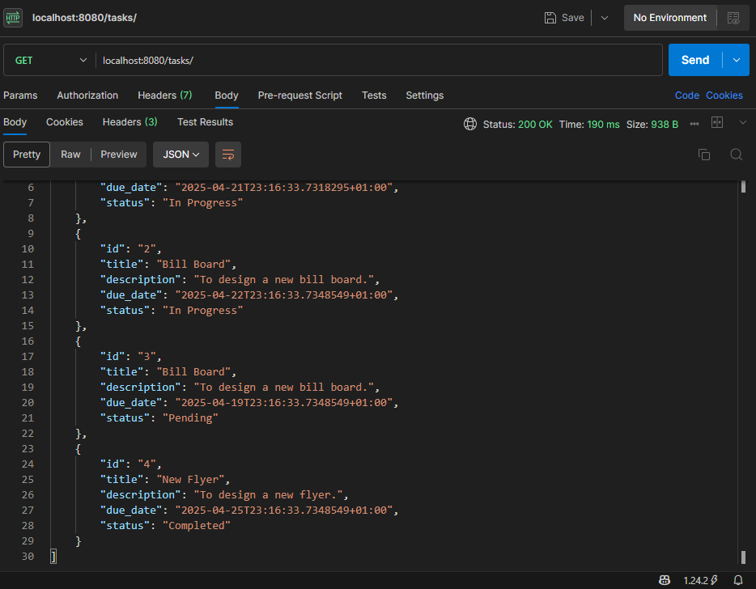
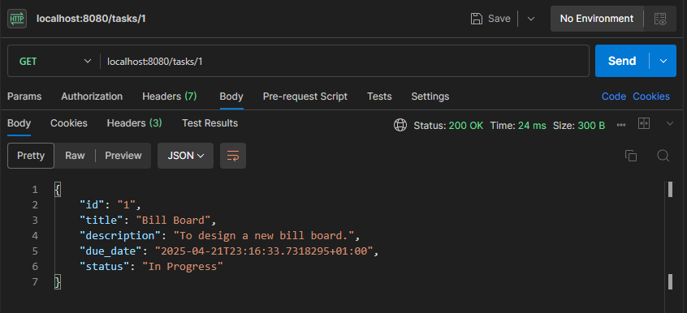
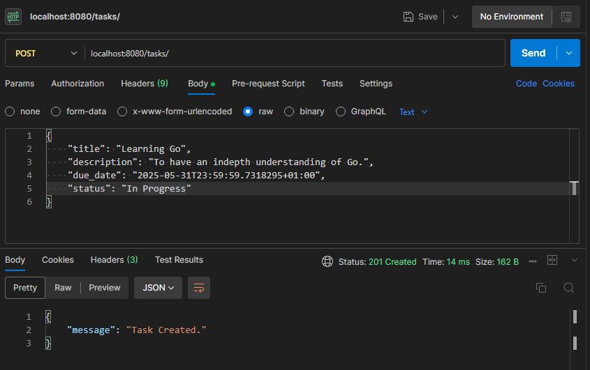
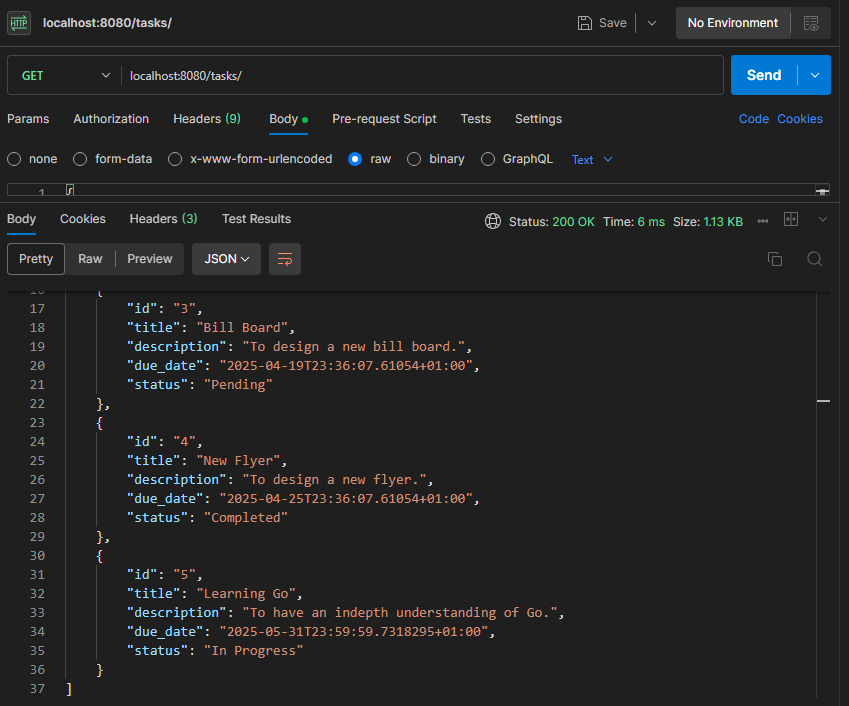
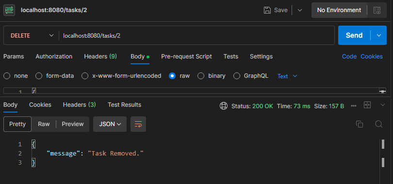
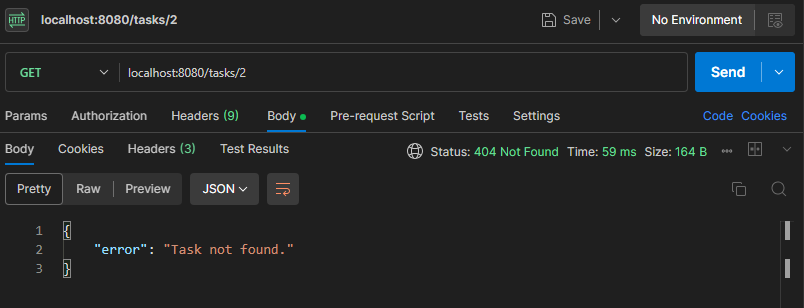
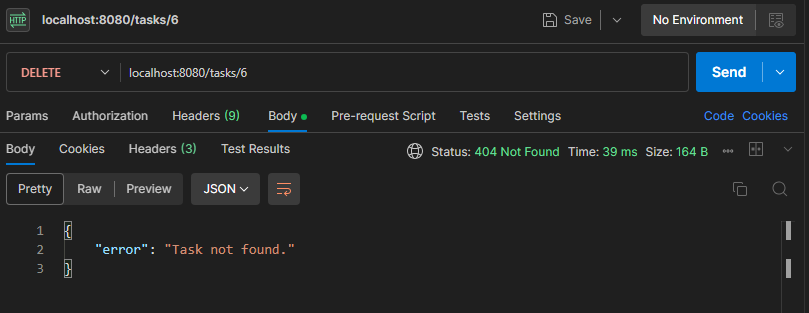
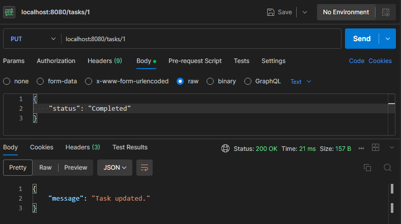
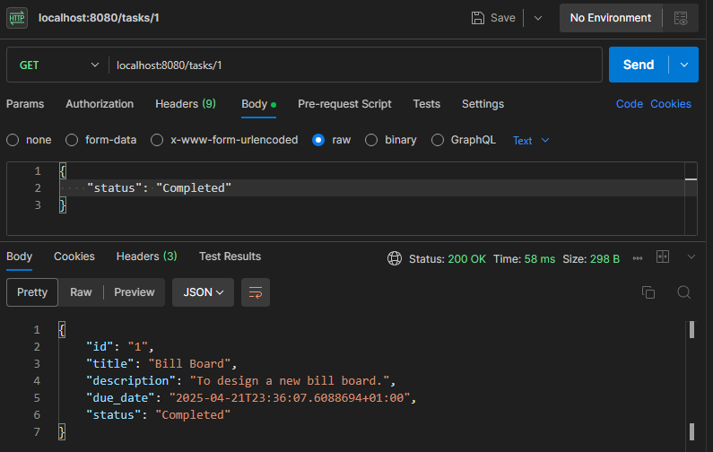

# Task Manager Functionalities
In the directory in the command line terminal, enter;

```shell
go run .
```

Visit at;
```web
localhost:8080/tasks
```

## Get All Tasks


## Get A Specific Task


## Post A New Task


### Confirm


## Delete A Task


### Confirm


### Deleting A Task That Doesn't Exist


## Updating a Task


### Confirm


## Postman Documentation
You can view the Postman documentation here.  
https://documenter.getpostman.com/view/43924120/2sB2cd5Jpj
